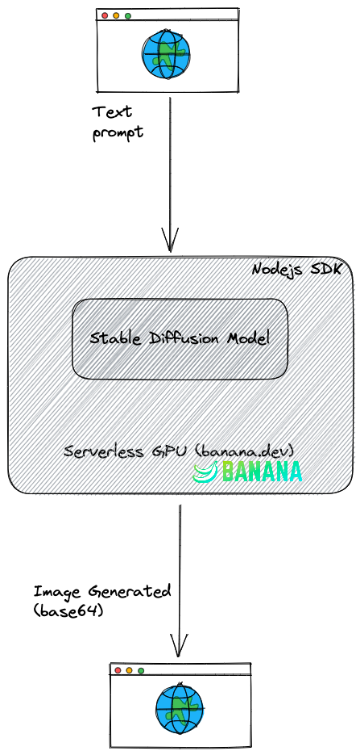

# Markleo AI Image Generator

Demo link: https://markleo.mharrvic.com

Repo link: [https://github.com/mharrvic/markleo](https://github.com/mharrvic/markleo)

## Overview

This is a demo app that shows how to use Stable Diffusion Model deployed to a Serverless GPU using Banana.dev

## Tech Stack

- [Next.js](https://nextjs.org)
- [NextAuth.js](https://next-auth.js.org)
- [Prisma](https://prisma.io)
- [Tailwind CSS](https://tailwindcss.com)
- [tRPC](https://trpc.io)
- [Serverless MySQL with PlantScale](https://planetscale.com/)
- [Stable Diffusion](https://github.com/Stability-AI/stablediffusion)
- [Serverless GPU with Banana.dev](https://banana.dev/)
- [Vercel](https://vercel.com)

## Demo Video

## Resources

- https://stablediffusion.vercel.app/ 100% inspired by this to help me understand the whole serverless gpu thing with banana.dev
- https://www.banana.dev/
- https://huggingface.co/stabilityai/stable-diffusion-2-1
